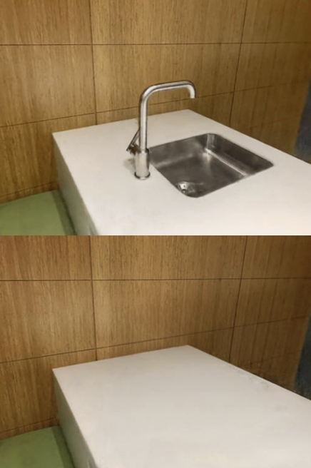
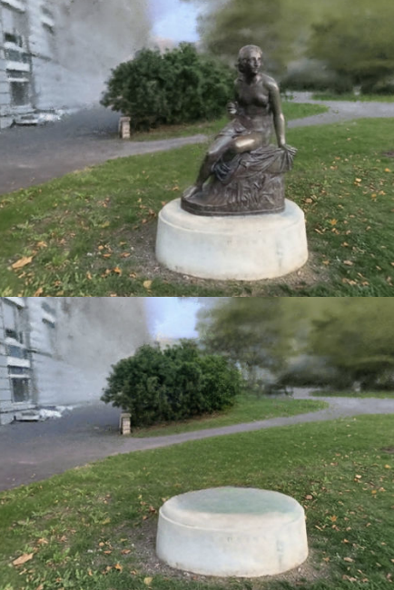
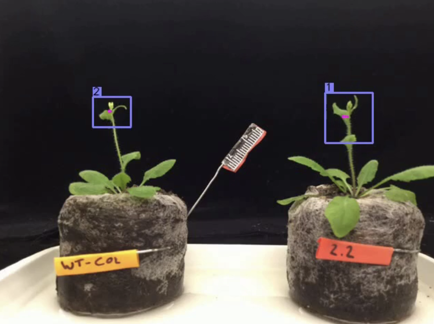
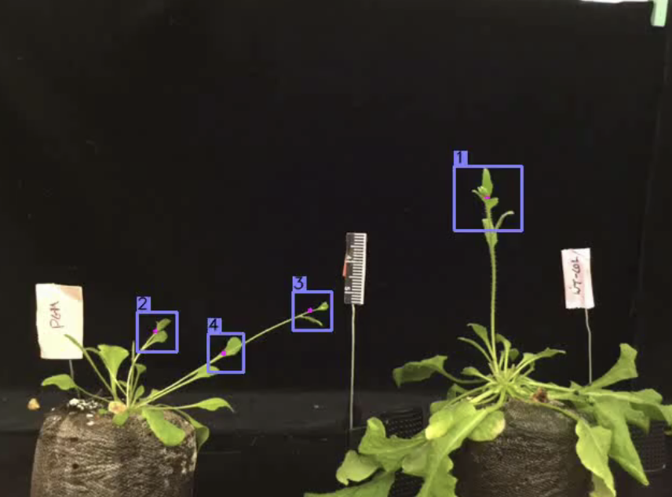

👋🏼 Hello there, my name is **Jieming Ma** (In its originality, **马介明**). I'm a graduate student in Computer Engineering at [New York University](https://www.nyu.edu/), [Tandon School of Engineering](https://engineering.nyu.edu/). Before that, I received my Bachelor in Electrical Engineering from Wuhan University of Science and Technology in 2020.

Previously, I spent a wonderful semester studying at Sichuan University, PMCIRI lab in spring 2021. I also interned at NYU Video Lab, Brooklyn in the spring and summer 2022, and NYU Multimedia and Visual Computing Lab, remotely in the spring and summer 2023, supervised by Pro. Yi Fang and Dr. Hao Huang. Now I am a research assistant at HIT(SZ), working with Pro. Lu Guangming.

My current research interests are in machine-learning and deep-learning models for solving computer-vision/image-processing tasks, with a particular focus on editable neural radiance field, medical image processing, and video object tracking.

Research Experiences
======
Research Assistant, at HIT(SZ), Nov 2023 -- Present

Research Assistant, supervised by [Professor Yi Fang](https://engineering.nyu.edu/faculty/yi-fang) and Dr. Hao Huang remotely, May 2023 -- Present

Research Intern, at [NYU Multimedia and Visual Computing Lab](https://nyuad.nyu.edu/en/research/faculty-labs-and-projects/multimedia-and-visual-computing-lab.html), Dec 2022 -- May 2023

Research Intern, at [NYU Video Lab](https://wp.nyu.edu/videolab/), Brooklyn supervised by Prof. Yao Wang, Jan 2022 -- May 2022

Selected Projects
======
### Removing objects from Neural radiance field ([demo](https://drive.google.com/drive/folders/10-qTFVi1lqTiYxr7q8Vnfe5t9Y6ejnxw?usp=sharing))

Neural Radiance Fields (NeRFs) have emerged as a popular approach for novel view synthesis. While NeRFs are quickly being adapted for a wider set of applications, intuitively editing NeRF scenes is still an open challenge. One important editing task is the removal of unwanted objects from a 3D scene, such that the replaced region is visually plausible and consistent with its context. To tackle this problem, we propose a unified Neural Radiance Field (NeRF) framework to effectively perform joint scene decomposition and composition for modeling real-world scenes. The decomposition aims at learning disentangled 3D representations of different objects and the background, allowing for scene editing, while scene composition models an entire scene representation for novel view synthesis.

### Synthetis 3D Spine volume reconstruction from biplanar X-rays (code releasing soon)

CT scans are associated with higher radiation exposure and cost compared to conventional X-ray imaging. In this study, we applied a Generative Adversarial Network (GAN) framework to reconstruct 3D spinal vertebrae structures from synthetic biplanar X-ray images, specifically focusing on anterior and lateral views. This approach leverages a novel feature fusion technique based on X2CT-GAN to combine information from both views and employs a combination of MSE loss and adversarial loss to train the generator, resulting in high-quality synthetic 3D spinal vertebrae CTs. We also contributed a spine-2-ct dataset that maps x-ray images to CT volumes which benefit further research. The results demonstrated the effectiveness of this approach in reconstructing 3D spinal vertebrae structures from biplanar X-rays.

### Plant Tracer Project ([web](https://planttracer.com/)) ([demo](https://drive.google.com/file/d/1itnG3V88YSmqFTKZPXTMCurP8GJogcph/view?usp=sharing))

”Plant Tracer” is a new App designed to enable the analysis of plant movement from time-lapse movies. Use Plant Tracer as part of a crowd-sourced method to search for novel mutant plants that do not move properly. This will help the scientific community identify new genes involved in plant movement and help reveal the genetic signals regulating plant movement. We Contributed a new dataset containing 100K frames for evaluating plant growing tracking performance in real scenes with novel metrics and reimplemented some influential algorithms, especially Spatio-temporal Transformer, JDE, and CenterTrack networks, and integrated them into a unified framework for convenient selection.

### Adan and WDPruning enhanced Vision Transformer ([code](https://github.com/jeremin77/HPML9143_Project))

Transformer models have demonstrated their promising potential and achieved excellent performance on a series of computer vision tasks. However, the huge computational cost of vision transformers hinders their deployment and application to edge devices. In this task, we will explore some techniques to reduce training time and Flops but the result does not compromise the accuracy. We implement a state-of-the-art optimization algorithm, Adaptive Nesterov Momentum Algorithm, and Width and Depth Pruning of VIT, a pruning method to reduce computational redundancy while minimizing accuracy loss. The results show that they can reduce training time and Flops but the result does not compromise the accuracy.

News
------
I am actively looking for full-time Ph.D. opportunities starting fall of 2024, please kindly reach out to me (<jm9013@nyu.edu>) if your team is hiring!
